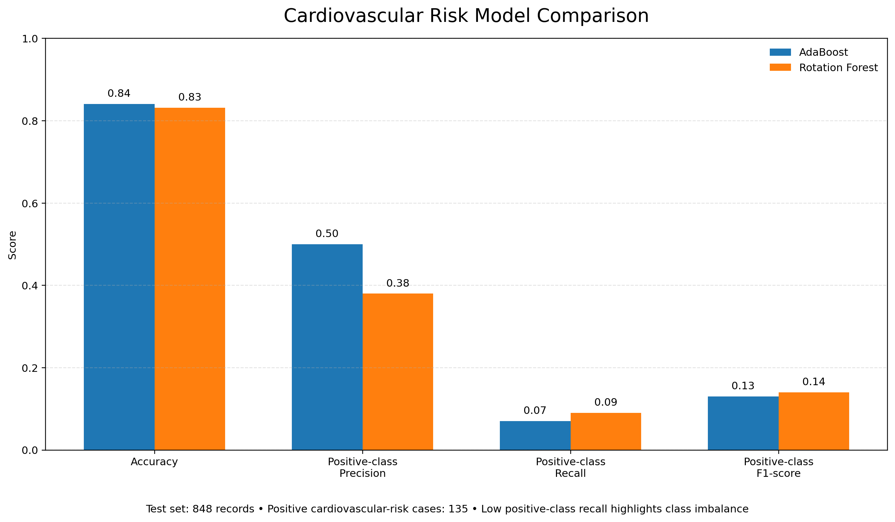

# Heart Health Diagnosis: Predictive & Descriptive Modelling

A portfolio project applying descriptive analytics and machine-learning techniques to assess cardiovascular disease risk using a Framingham Heart Study–based dataset.

The project compares ensemble-based predictive models, including AdaBoost and a custom Rotation Forest implementation, while examining demographic, behavioural, and clinical indicators such as age, smoking behaviour, blood pressure, BMI, cholesterol, glucose, and diabetes status.

## Project Objectives

* Explore key cardiovascular-risk indicators through descriptive analytics.
* Prepare health data for predictive modelling.
* Build and evaluate AdaBoost and Rotation Forest classification models.
* Compare model performance using accuracy, precision, recall, F1-score, and confusion matrices.
* Highlight the effect of class imbalance on high-risk cardiovascular disease detection.

## Models Used

### AdaBoost

An ensemble classifier that combines multiple weak learners to improve predictive performance.

### Rotation Forest

A custom ensemble implementation that applies bootstrap sampling and Principal Component Analysis (PCA) before training decision trees.

## Results

Both models were evaluated on a test set of 848 records, including 135 positive cardiovascular-risk cases.

| Model           | Overall Accuracy | Positive-Class Precision | Positive-Class Recall | Positive-Class F1-Score |
| --------------- | ---------------: | -----------------------: | --------------------: | ----------------------: |
| AdaBoost        |       **84.08%** |                     0.50 |                  0.07 |                    0.13 |
| Rotation Forest |       **83.14%** |                     0.38 |                  0.09 |                    0.14 |

### Model Performance Visual

*AdaBoost achieved the highest overall accuracy, while Rotation Forest produced slightly stronger recall and F1-score for the positive cardiovascular-risk class.*

## Key Insight

The project achieved strong overall accuracy; however, both models showed low recall for the positive cardiovascular-risk class. This reflects class imbalance in the dataset and demonstrates why accuracy alone should not be treated as sufficient for healthcare-related classification tasks.

## Repository Structure

* `python/prepare_dataset.py` — prepares and shuffles the source dataset.
* `python/adaboost_model.py` — AdaBoost classification model.
* `python/baseline_adaboost_model.py` — baseline AdaBoost implementation.
* `python/rotation_forest_model.py` — custom Rotation Forest model.
* `python/model_comparison.py` — compares AdaBoost and Rotation Forest performance.
* `sas/heart_health_analysis.egp` — SAS Enterprise Guide analysis project.
* `results/model_comparison_results.png` — portfolio-ready model comparison visual.

## Data Access

Raw CSV data is intentionally not included in this public repository.

To run the project locally, create a folder named `data` in the repository root and add:

* `heart_disease_cp2.csv`
* `cp2_shuffled.csv`

Then install the required Python libraries and run the scripts from the `python` folder.

## Tools and Technologies

* Python
* Pandas
* NumPy
* Scikit-learn
* SAS Enterprise Guide
* PyCharm
* Microsoft Excel

## Responsible Use

This project is for academic and portfolio demonstration purposes only. It is not a clinical diagnostic tool and must not be used as a substitute for professional medical advice or medical decision-making.

## Author

Lekshmy Natesh

